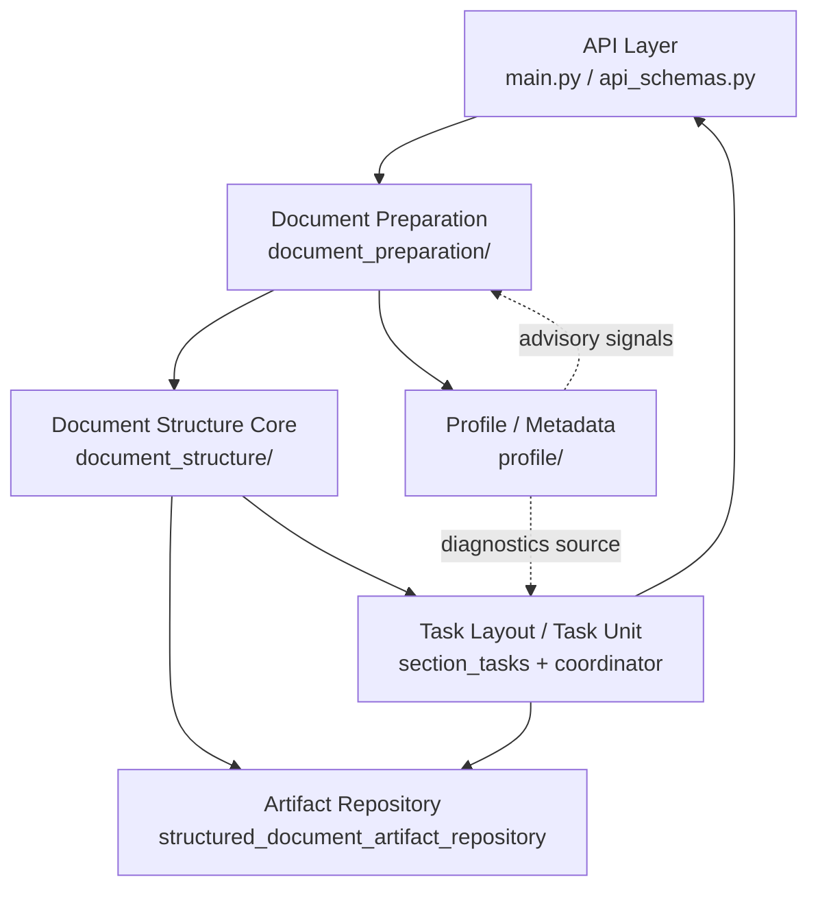

# Deep Reflective Reader High-Level Design

> 事實標註：
> - **[Code-Confirmed]**：已由目前 codebase 直接確認
> - **[From Proposal]**：來自 `proposal.md` 的整理描述
> - **[Needs Confirmation]**：目前資訊不足或需 maintainer 明確決策

## 1. Purpose of This Document

本文件用途是描述 Deep_Reflective_Reader 的高層技術設計，重點包含：

- 建立 module map
- 明確 module responsibility
- 描述主要 data flow
- 固定 hierarchy-first architecture
- 區分 implemented / planned / open questions

本文件不是產品簡介，也不是低層實作說明。**[Code-Confirmed]**

---

## 2. Design Scope

本文件覆蓋：

- high-level module architecture
- module responsibility
- module relationships
- primary data flow
- persistence boundary
- diagnostics boundary
- parser / profile / artifact / task-layout 關係

本文件不覆蓋：

- function-level implementation
- prompt wording details
- algorithm 細節
- database selection
- UI design
- deployment design
- performance tuning

**[Code-Confirmed]**

---

## 3. System Overview

目前系統可抽象為：

```text
Raw Document
  -> Document Preparation
  -> Parser Metadata
  -> Structured Hierarchy
  -> Post-Structure Metadata
  -> Task Layout
  -> Summary / Quiz / Artifacts
  -> Diagnostics / Recommendation
```

高層語義：

- Structured Hierarchy 是核心 contract。**[Code-Confirmed]**
- `chapters[].sections[].task_units[]` 是主 persistence source。**[Code-Confirmed]**
- task-layout 是 projection/read path。**[Code-Confirmed]**
- diagnostics 是 projection，不是 hidden mutation。**[Code-Confirmed]**
- metadata 是 advisory，不是 parser authority。**[Code-Confirmed]**

---

## 4. Core Design Principles

### 4.1 Hierarchy-first
- meaning：runtime 與主要資料模型優先使用 chapter/section hierarchy。
- why it matters：避免 flat mirror drift，讓 targeting/persistence 一致。
- affected modules：`document_structure/`, `section_tasks/`, `app/section_task_coordinator.py`。
- 標註：**[Code-Confirmed]**

### 4.2 Pure hierarchy persistence
- meaning：新輸出預設不再寫 root `sections[]` 與 `structure_nodes[]` mirror。
- why it matters：降低雙表示同步成本與資料重複。
- affected modules：`document_structure/structured_document.py`, repository。
- 標註：**[Code-Confirmed]**

### 4.3 Metadata as advisory
- meaning：`parser_metadata`/`post_structure_metadata` 提供提示與診斷，不直接主導 parser。
- why it matters：避免 LLM/profile 成為不可控 parser authority。
- affected modules：`profile/`, `document_preparation/`。
- 標註：**[Code-Confirmed]**

### 4.4 Diagnostics as projection
- meaning：diagnostics 由 persisted metadata + current layout state 組合投影。
- why it matters：診斷要反映當前讀取狀態，同時不造成隱性寫入。
- affected modules：`section_tasks/document_task_layout.py`, `app/section_task_coordinator.py`。
- 標註：**[Code-Confirmed]**

### 4.5 Explicit write paths only
- meaning：summary/quiz/task-layout metadata 透過明確 repository write path 更新。
- why it matters：避免 side effects 分散在 read path。
- affected modules：`document_structure/structured_document_artifact_repository.py`, coordinator。
- 標註：**[Code-Confirmed]**

### 4.6 LLM as helper, not authority
- meaning：LLM 用於 classification/generation，搭配 deterministic 機制與 fallback。
- why it matters：提高穩定性、可回歸性。
- affected modules：`profile/document_profile_builder.py`, `profile/parser_metadata_extractor.py`, section task services。
- 標註：**[Code-Confirmed]**

### 4.7 Backward compatibility without new legacy writes
- meaning：保留舊 JSON 可讀，不再預設產生新 legacy mirror。
- why it matters：遷移過程可持續，但不再擴大技術債。
- affected modules：`structured_document.py`, repository load/migration path。
- 標註：**[Code-Confirmed]**

### 4.8 Parser strategy evolves gradually
- meaning：先有 recommendation/diagnostics，再決策是否導入自動策略切換。
- why it matters：降低 parser 行為突變風險。
- affected modules：`enhanced_parse_trigger_evaluator.py`, coordinator, API。
- 標註：**[Code-Confirmed]** + **[Needs Confirmation]**（是否進 auto-switch）

### 4.9 Parser metadata cache-first usage (common parser)
- meaning：`DocumentProfile.parser_metadata` 可作為 common parser 的快取輔助訊號；在 `force_rebuild=false` 且 source hash 未變時，優先重用既有 common parser 結果。
- why it matters：減少重複計算，保留前一次 profile/LLM 分析上下文，為後續 enhanced parser 決策提供穩定背景。
- affected modules：`document_preparation/`, `profile/`, `document_structure/`（策略層）。
- 標註：**[From Proposal]** + **[Needs Confirmation]**（需對齊最終 cache key/hash contract）

### 4.10 Two-layer normalized hierarchy as current scope
- meaning：目前高層結構固定為 `chapter -> section`；不在本期引入 `Part -> Chapter` 持久化層級。
- why it matters：聚焦普遍文檔型態，避免為少數多層案例提前擴大 schema 複雜度。
- affected modules：`document_structure/`, `section_tasks/`, `profile/`（主要是 contract 與 metadata 表達）。
- 標註：**[From Proposal]**（maintainer決策）+ **[Needs Confirmation]**（是否凍結為本期 non-goal）

---

## 5. High-Level Module Map

### 5.1 API Layer
- 模組：`main.py`, `api_schemas.py`
- 責任：暴露 preparation、task-layout、summary/quiz、reparse 等 endpoint。
- 邊界：不承擔核心解析/持久化邏輯。
- 標註：**[Code-Confirmed]**

### 5.2 Configuration / Dependency Assembly
- 模組：`config/`（特別是 `config/container.py`, `config/app_DI_config.py`）
- 責任：組裝 providers/services/repositories，集中 runtime config。
- 標註：**[Code-Confirmed]**

### 5.3 Document Preparation Layer
- 模組：`document_preparation/`
- 責任：raw loading、language detection、profile build、structured build、FAISS、bundle。
- 特點：已包含 post-structure enrichment step。
- 標註：**[Code-Confirmed]**

### 5.4 Document Structure Core
- 模組：`document_structure/`
- 責任：hierarchy contract、split/build、hierarchy index、artifact repository、enhanced parse evaluator。
- 標註：**[Code-Confirmed]**

### 5.5 Profile / Metadata Layer
- 模組：`profile/`
- 責任：`DocumentProfile`、`parser_metadata`、`post_structure_metadata`、evidence/classification。
- 邊界：metadata 為 advisory 訊號來源。
- 標註：**[Code-Confirmed]**

### 5.6 Task Layout / Task Unit Layer
- 模組：`section_tasks/` + `app/section_task_coordinator.py`
- 責任：task-layout projection、task unit resolution、artifact availability/cache validity、summary/quiz orchestration。
- 標註：**[Code-Confirmed]**

### 5.7 Prompt / LLM Interaction Layer
- 模組：`prompts/`（`prompt_assembler.py`）與各 task prompt builder（在 `section_tasks/`）
- 責任：組裝 prompt、注入 profile/context。
- 邊界：不應成為 parser authority。
- 標註：**[Code-Confirmed]**

### 5.8 Shared Utilities
- 模組：`shared/`
- 責任：跨模組資料結構（`TaskUnit`, `TaskArtifacts`, `DocumentTaskArtifacts`）
- 標註：**[Code-Confirmed]**

### 5.9 Tests
- 現況：專案主要是 `scripts/test_*.py`；未看到 `tests/` 目錄。
- 責任：regression、hierarchy purity、artifact persistence、diagnostics 行為驗證。
- 標註：**[Code-Confirmed]**

---

## 6. Module Relationship Diagram



說明：
- 實線：主要 read/write 依賴。
- 虛線：advisory/diagnostics 依賴，不是 parser 強制控制。
- 標註：**[Code-Confirmed]**

---

## 7. Primary Data Flow

### 7.1 Preparation Flow
- Raw document 載入後，先做 language detection 與 profile。
- 接著建 structured hierarchy，再做 post-structure enrichment。
- common parser 結果在 cache 可用（且未 force rebuild / hash 未變）時可重用，避免重算。
- 標註：**[Code-Confirmed]**

### 7.2 Task Layout Flow
- 由 structured document 讀取有效 hierarchy sections，組成 chapters-first layout projection。
- 標註：**[Code-Confirmed]**

### 7.3 Artifact Write Flow
- section/chapter summary/quiz 與 task-layout metadata 透過 repository 更新 hierarchy 節點。
- 標註：**[Code-Confirmed]**

### 7.4 Diagnostics Flow
- persisted profile metadata + current layout section state，形成 `profile_diagnostics`。
- 不回寫 profile store。
- 標註：**[Code-Confirmed]**

### 7.5 Enhanced Parser Recommendation Flow
- 由 evaluator 產生 score/reasons/metrics，於 task-layout response 暴露 recommendation。
- 目前預期流程是「提示用戶分數與理由，由用戶手動觸發 reparse」，不做自動 rerun。
- 標註：**[Code-Confirmed]**（recommendation）+ **[From Proposal]**（manual reparse policy）

### 7.6 Document shape normalization flow (current policy)
- flat 長文：可走 llm parser 拆成多章，chapter 名稱可由 LLM 產生。**[From Proposal]**
- flat 短文：若只足夠單一 task unit（或語義不足以分章），固定單章。**[From Proposal]**
- chapter-only 文檔：尊重章級結構；每個 chapter 保持唯一 section（同名、不同 id）。**[From Proposal]**
- 標準文檔：先 common，結果不佳再由 recommendation 引導手動 llm reparse。**[From Proposal]**
- 多層細碎文檔：仍收斂為 chapter-section；更細層級語意化為 task units，並把層級線索記錄於 metadata。**[From Proposal]**

---

## 8. Persistence Boundary

### 8.1 Persisted data
- Source of truth：`chapters[].sections[].task_units[]`。
- profile artifact：`topic/summary/document_language/parser_metadata/post_structure_metadata`。
- 標註：**[Code-Confirmed]**

### 8.2 Runtime projection
- `DocumentTaskLayoutResponse` 與 `profile_diagnostics` 是 read projection。
- 標註：**[Code-Confirmed]**

### 8.3 Legacy compatibility
- root `sections[]`、`structure_nodes` 可讀取，但非新 persistence 預設輸出。
- 標註：**[Code-Confirmed]**

### 8.4 Future candidate data
- parser hints 正式進入 parser strategy。
- 標註：**[Needs Confirmation]**

---

## 9. Parser / Profile / Diagnostics Boundary

Parser：
- 建立 structured hierarchy（chapters/sections）。**[Code-Confirmed]**
- 不應被 metadata 直接硬控制。**[Code-Confirmed]**
- 目前 `parser_metadata` 對 common parser 的角色是 cache/省算輔助，不是切分規則約束。**[From Proposal]**

Profile：
- 保存 pre-structure `parser_metadata` 與 post-structure snapshot。**[Code-Confirmed]**
- 支援 recommendation/diagnostics 的觀測素材。**[Code-Confirmed]**

Diagnostics：
- 在 task-layout runtime 生成的 projection。**[Code-Confirmed]**
- 可能混合 persisted metadata 與 current layout state。**[Code-Confirmed]**
- 不應自動回寫 profile。**[Code-Confirmed]**

**metadata is advisory, not authority.**

---

## 10. Implemented vs Planned Capabilities

| Capability | Status | Evidence / Module | Notes |
|---|---|---|---|
| hierarchy-first StructuredDocument | Implemented | `document_structure/structured_document.py` | chapters 為 primary source |
| hierarchy-only artifact persistence | Implemented | `document_structure/structured_document_artifact_repository.py` | load-time migration + hierarchy write |
| task-layout hierarchy projection | Implemented | `app/section_task_coordinator.py`, `main.py`, `api_schemas.py` | chapters-first public response |
| section summary persistence | Implemented | coordinator + repository | hierarchy section artifacts |
| section quiz persistence | Implemented | coordinator + repository | hierarchy section artifacts |
| task-unit artifact persistence | Implemented | coordinator + repository | task unit artifacts under hierarchy |
| chapter summary / quiz support | Implemented | `main.py`, `api_schemas.py`, coordinator | chapter_id 優先 targeting |
| parser_metadata extraction | Implemented | `profile/parser_metadata_extractor.py` | deterministic + merge classification |
| post_structure_metadata enrichment | Implemented | `profile/post_structure_metadata_enricher.py`, pipeline | Step 4.5 |
| diagnostics projection | Implemented | `section_tasks/document_task_layout.py`, coordinator | mixed-source, read-only projection |
| enhanced parse recommendation | Implemented | `document_structure/enhanced_parse_trigger_evaluator.py` | score/reasons/metrics |
| parser metadata guided parsing | Partially Implemented | pipeline TODO + maintainer policy | 目前僅允許 cache 可用性/省算輔助，不約束 common parser 規則 |
| auto parser switching | Planned | recommendation exists only | 現階段 policy 為「提示 + 使用者手動重觸發」 |
| Part -> Chapter nested hierarchy | Not Planned (Current Scope) | maintainer policy | 目前明確聚焦兩層模型，不做 persistence-level Part 層 |

---

## 11. Current Architectural Risks

1. metadata 被誤用為 parser hard rule
- why risky：可能造成不可預期 parse 漂移。
- affected modules：`profile/`, `document_preparation/`, `document_structure/`。
- guardrail：維持 advisory contract + 測試限制 parser consumption。

2. diagnostics 被誤寫回 profile
- why risky：read path 產生 hidden mutation，造成觀測污染。
- affected modules：coordinator、profile store。
- guardrail：固定「task-layout 不寫 profile」測試。

3. task-layout read path 回滲 legacy fallback
- why risky：破壞 hierarchy-only runtime 假設。
- affected modules：coordinator、hierarchy index。
- guardrail：對 `document.sections` fallback 設 fail-fast regression。

4. legacy mirror 被重新引入新寫入
- why risky：再度出現雙表示同步問題。
- affected modules：structured model serialization、repository。
- guardrail：to_dict 預設輸出契約測試。

5. LLM enhanced recommendation 與 parser 切換責任不清
- why risky：若未固定「僅提示、手動重觸發」契約，後續可能出現隱性 auto-switch 或策略分歧。
- affected modules：evaluator、coordinator、API。
- guardrail：先 formalize decision contract，再談自動化。

6. 多層文檔語義若未妥善下沉到 metadata / task units
- why risky：會把少數多層案例誤導成錯誤章節語義，影響 recommendation 與 target safety。
- affected modules：parser、profile、task-layout diagnostics。
- guardrail：固定兩層模型前提下，強化「層級線索進 metadata」與回歸測試。

7. artifact persistence 與 hierarchy contract 漂移
- why risky：artifact visibility、cache validity 會失真。
- affected modules：repository、task-layout projection。
- guardrail：section/chapter/task-unit visibility 回歸測試持續化。

8. module 邊界增長後的耦合風險
- why risky：coordinator 過重時容易承擔過多策略責任。
- affected modules：`app/section_task_coordinator.py`。
- guardrail：維持 high-level contract，避免低層邏輯跨層擴散。

---

## 12. Open Questions for Maintainer

1. 本 high-level-design.md 主要讀者是 maintainer 本人、協作者，還是未來開源讀者？
2. 是否將「兩層模型（chapter-section）且 Part->Chapter 非本期目標」正式寫入 non-goals？
3. common parser cache 重用的最終判斷鍵是否固定為 `source_hash + parser_mode + profile_version`（或其他組合）？
4. cache 失效策略是否需要明確區分：`force_rebuild`、raw hash 變更、parser version 變更、profile schema 變更？
5. `profile_diagnostics` 是否需要正式文件化為 API contract？
6. `proposal.md` 中 maintainer-provided 實測結論，哪些需要再補 code-confirmed 或可重現 smoke 證據？
7. 下一版是否需要加入 sequence diagrams（prepare / task-layout / artifact write）？
8. 是否要在本文件加入 module ownership / boundary ownership（誰負責哪層）？
9. 是否要加 non-goals 區塊，避免 parser/profile/diagnostics 職責重新混淆？
10. 是否要加 migration history（dual representation -> pure hierarchy）章節？
11. `find_*_effective(...allow_legacy_fallback)` 的退場時間點是否現在就定義？
12. 是否要把 recommendation 與 diagnostics 區分為兩份對外文件（產品語義 vs 技術語義）？

---

## 13. Next Revision Plan

下一輪建議補完路徑：

1. 先收斂 maintainer 對 Open Questions 的回答。
2. 確認 ambiguous module 邊界（特別是 parser strategy 與 diagnostics contract）。
3. 精修 module relationship（必要時加 1~2 個 sequence diagram）。
4. 若 maintainer同意，新增 roadmap section（僅 high-level milestone）。
5. 若 maintainer同意，補 API contract section（特別是 diagnostics/ recommendation）。
6. 若 maintainer同意，補 migration history 與 non-goals。
